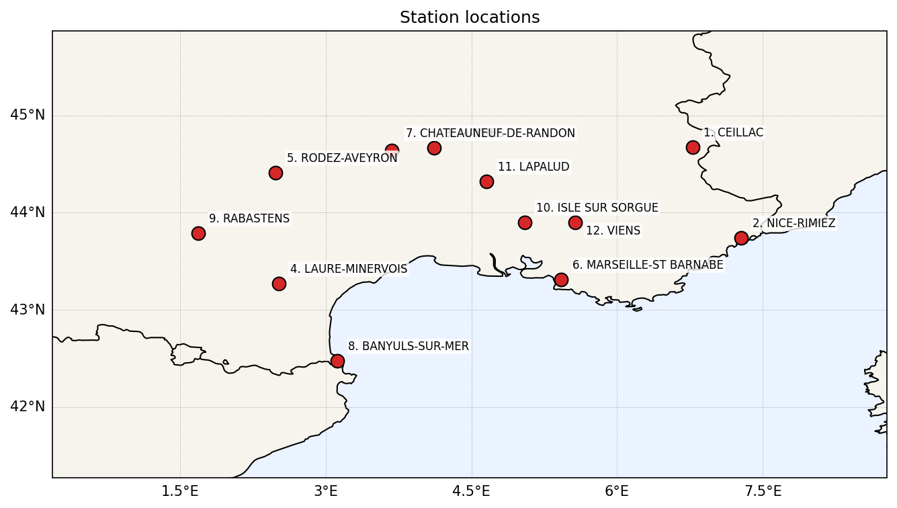
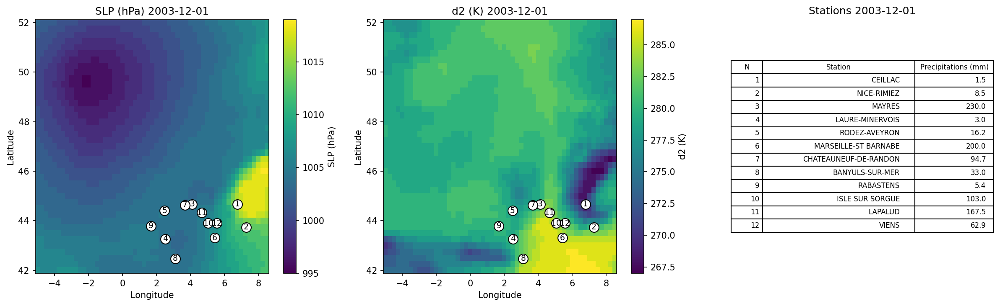
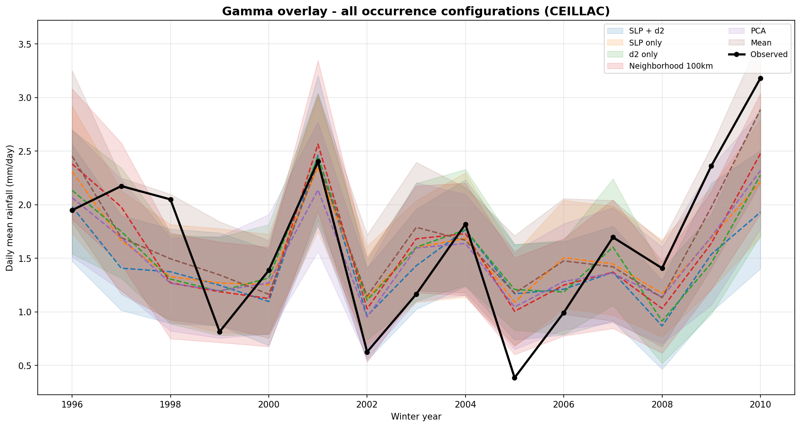

# DownscaleRainfall

## Introduction

It starts from a simple question: can we use large-scale ERA5 weather fields to reconstruct local daily rainfall at station level?  
To answer this, we combine two complementary sources of information: ERA5 predictors (sea-level pressure `SLP` and 2 m dew-point temperature `d2`) and local station observations (daily precipitation records).  
Because rainfall has many dry days and highly variable wet-day amounts, we split the task into two connected steps: first, estimating whether rain occurs; second, estimating how much rain falls when it does.  
This two-part structure gives us a clear and interpretable pipeline, makes diagnostics easier at each stage, and helps us understand where errors come from.  
As a result, the project provides a solid statistical baseline for winter precipitation (DJF) and an open framework where new features, models, and calibration strategies can be tested.

## From data to daily rainfall prediction

We start from two complementary datasets and one prediction target.

**Local station data (what we want to predict).**  
The map below shows the 12 rain gauges used in the study.  
At each station, we observe daily precipitation, which becomes our station-level target series.



**ERA5 large-scale predictors (what we use as inputs).**  
For each day, we use gridded ERA5 fields over the region:
- `SLP`: sea-level pressure (hPa),
- `d2`: 2 m dew-point temperature (K).

**Daily target construction.**  
In the one-day snapshot below, the two maps (SLP and d2) are paired with the station precipitation table for the same date.  



From there, we apply a two-step strategy (occurrence, then intensity) and evaluate the ability to reproduce observed winter rainfall behavior.

## Core Equation

We first present the conditional **joint density across stations**:

$$
f(\mathbf r_t\mid X_t)=
\prod_{i=1}^{N}\Big[
p_i(X_t)\,g_i(r_t^i\mid X_t)\,\mathbf{1}_{\{r_t^i>0\}}
\,
\big(1-p_i(X_t)\big)\mathbf{1}_{\{r_t^i=0\}}
\Big].
$$

Then we break it down:

- $\mathbf r_t=(r_t^1,\dots,r_t^N)$: rainfall vector at day $t$ for all stations.
- $X_t$: large-scale ERA5 predictors at day $t$ (here mainly `SLP`, `d2`).
- $p_i(X_t)=\Pr\!\left(R_t^i>0\mid X_t\right)$: rain occurrence probability for station $i$.
- $g_i(\cdot\mid X_t)$: density for positive rainfall amounts at station $i$ (Gamma / Gamma-GLM / Gamma+GPD).
- $\mathbf{1}_{\{r_t^i>0\}}$: activates the rainy-day component.
- $\mathbf{1}_{\{r_t^i=0\}}$: activates the dry-day component.
- The product over $i$ means we use conditional independence across stations given $X_t$.

Equivalent generative view:

$$
R_t^i=
\begin{cases}
0, & \text{with probability } 1-p_i(X_t),\\
Z_t^i, & \text{with probability } p_i(X_t),
\end{cases}
\qquad
Z_t^i\sim g_i(\cdot\mid X_t), \quad i=1,\dots,N.
$$

## Part 1: Occurrence Modeling

For occurrence, we use logistic regression because it is adapted to a binary decision (rain / no rain).  
It maps large-scale predictors to a probability between $0$ and $1$.  
If rainfall-favorable conditions are present in $X_t$, then $p_i(X_t)$ increases; otherwise it decreases.

Rain occurrence probability is modeled as:

$$
p_i(X_t)=\frac{\exp\!\left(X_t^\top \lambda_i\right)}{1+\exp\!\left(X_t^\top \lambda_i\right)}
$$

where $\lambda_i$ are regression parameters estimated for each station.

Tested occurrence configurations:

- full grid `SLP + d2`
- `SLP` only
- `d2` only
- 100 km neighborhood
- PCA-reduced predictors

## Part 2: Intensity Modeling

Once rain is triggered, we model rainfall amount with a Gamma distribution:  
it only takes strictly positive values, it is asymmetric (many small rainfall amounts, a few large ones), and it can represent station-wise variability.

For rainy days ($r>0$), the Gamma density is:

$$
G(r\mid k,\theta)=\frac{r^{k-1}\exp(-r/\theta)}{\Gamma(k)\,\theta^k}
$$

with $k>0$ (shape parameter) and $\theta>0$ (scale parameter).

In practice, once the occurrence model is built, we fit the rainfall-intensity part with the following Gamma-family variants:

- **Gamma** (stationary parameters per station),
- **Gamma-GLM** (conditional mean driven by predictors),
- **Gamma+GPD** (tail extension for extremes).



## Tests and Benchmark

- Occurrence: evaluated with Accuracy, F1, ROC/AUC, and threshold optimization.
- Intensity/simulation: evaluated on winter cumulative rainfall with RMSE/MAE.

## What is next

Looking for improvements and contributions are welcome:

- better predictors / feature engineering,
- calibration of occurrence probabilities,
- alternative intensity distributions,
- station-wise model selection strategies,
- methods that improve F1 and reduce winter RMSE.

If you can push the score higher, feel free to fork, test, and propose changes.

## Data

Hugging Face dataset:  
`https://huggingface.co/datasets/saadtaleb/precipitations-era5-stations`

Quick download:

```powershell
python scripts/download_data.py
```

## Setup and Run

```powershell
python -m venv venv
.\venv\Scripts\python -m pip install -r requirements.txt
python scripts/run_all.py
```

If data is already present locally, you can skip download:

```powershell
python scripts/run_all.py --skip-download
```

Or run the pipeline step by step:

```powershell
python scripts/download_data.py
python scripts/run_data_preparation.py
python scripts/run_exploration.py
python scripts/run_occurrence_models.py
python scripts/run_threshold_optimization.py
python scripts/run_gamma_model.py
python scripts/run_gamma_glm.py
python scripts/run_gamma_gpd_extension.py
python scripts/run_model_comparison.py
```
